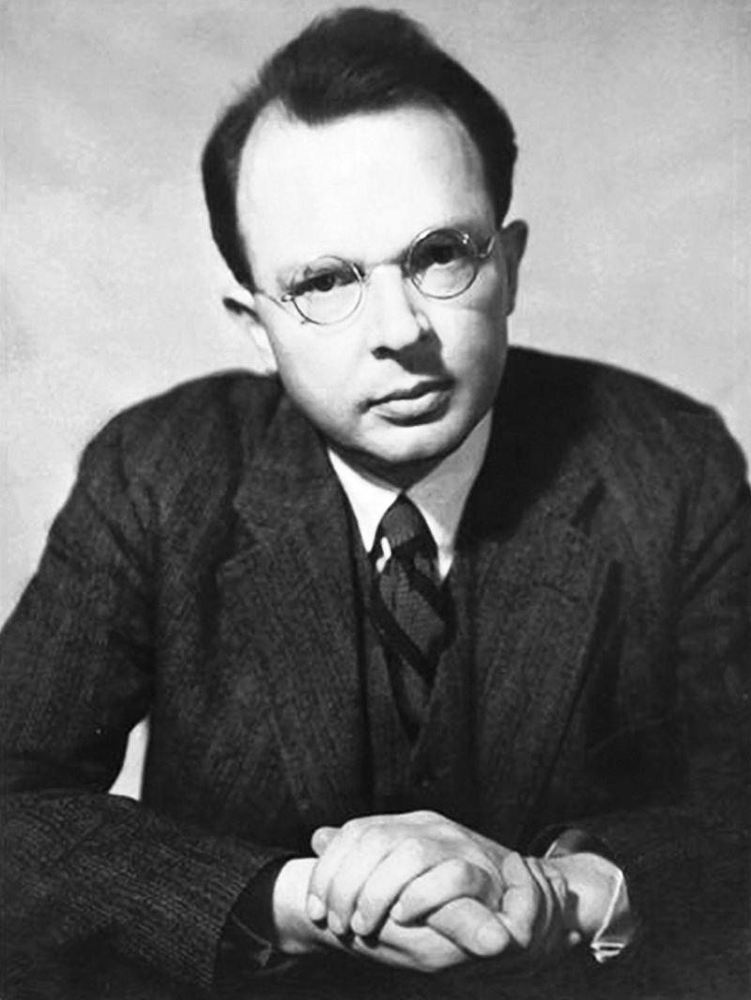

## Overview

- The Original Verifiability Criterion and its issues
- Leitgeb's New Verifiability Criterion
- The question of probability
- Inductive Logic

---

## Motivation for the Criterion

:::: {.columns}

::: {.column width="70%"}
> "The connection between meaning and confirmation has sometimes been formulated by the thesis that a sentence is meaningful if and only if it is verifiable, and that its meaning is the method of its verification. The historical merit of this thesis was that it called attention to the close connection between the meaning of a sentence and the way it is confirmed."

[@carnap1936testability, p.421]

:::

::: {.column width="30%"}
{width=100%}
:::

::::

---

:::: {.columns}

::: {.column width="70%"}
### Carnap: Verification is too Narrow

**Excludes some scientific statements:**

- Universal statements (laws of nature) are not verifiable
- Only single instances can be checked, never all instances

**Even mundane statements potentially problematic:**

- "There is a white sheet of paper on the table"
- Even this has potentially infinitely many testable implications

:::

::: {.column width="30%"}
{width=100%}
:::

::::

---

### Solution: Move from Verification to (Dis)confirmation

::: {.vcenter style="font-size: 50px;"}
**OVC**: A declarative sentence is meaningful iff it is **confirmable or disconfirmable**.
:::

---

## The Self-Undercutting Problem

**Issue**: OVC is itself not confirmable or disconfirmable

::: {.incremental}
- But: Principle of tolerance:
  - There is no unique "correct" framework---no unique correct language or logic. OVC is one way in which we can choose to structure our scientific discourse.
- With this in mind, consider: The only maxim we can adopt if we want to conceive of ourselves as lawgivers in a possible kingdom of ends is: Only say what is confirmable or disconfirmable.
:::

---

## Normative Statements and the Fact-Value Dichotomy

Carnap in *The Unity of Science*: 

- In the empirical sciences, the logical relationship of their statements to protocol / observation statements can be drawn out. Trying to do this with the statements of classical Philosophy shows the absence of such relations.

>"All statements belonging to Metaphysics, regulative Ethics, and (metaphysical) Epistemology have this defect, are in fact unverifiable and, therefore, unscientific. In the Viennese Circle, we are accustomed to describe such statements as nonsense (after *Wittgenstein*). "

[@carnap1934unity, p. 26]

---

## Putnam{.smaller}

:::: {.columns}

::: {.column width="70%"}
### Verifiability Commits us to a Dichotomy of Fact and Value
> The verifiability criterion implies a dichotomy of values and facts: ethics is not a matter of facts, and matters of fact have nothing to do with ethics

[@putnam_collapse_2004, p.19]

:::

::: {.column width="30%"}
{width=100%}
:::

::::

---

### Values and Rational Acceptability

:::: {.columns}

::: {.column width="70%"}

**Factual statements presuppose values:**
- Coherence, comprehensiveness, simplicity, instrumental efficacy
- Part of our idea of **cognitive flourishing** and **eudaimonia**

**Implication**: Some values must be objective (unless science is merely subjective)
:::

::: {.column width="30%"}
{width=100%}
:::

::::

--- 

## Thick Ethical Concepts

:::: {.columns}

::: {.column width="70%"}

### Examples
- "Considerate", "gentle", "cruel"

### Dual Function
1. **Descriptive**: Explain and predict behavior
2. **Evaluative**: Cannot really say something like "Jones is inconsiderate, envious, self-centered and cruel; but he is also a very good person."

:::

::: {.column width="30%"}
{width=100%}
:::

::::

---

:::: {.columns}

::: {.column width="70%"}

### Indispensability
- Essential for adequate description of reality
- If someone, in their description of someone else, failed to mention that the person is *considerate* or *generous*, they may themselves be criticized as imperceptive or superficial.

:::

::: {.column width="30%"}
{width=100%}
:::

::::

---

## Leitgeb's promise:

:::: {.columns}

::: {.column width="60%"}

> "...Are statements of string theory meaningful with respect to the language of relativity theory/quantum mechanics and the set of probability measures available to present-day physicists? Are prescriptive (normative or evaluative) sentences meaningful with respect to a set of descriptive sentences and the set of probability measures available to competent ordinary speakers or professional moral philosophers? (Assuming that probabilities have been assigned to prescriptive sentences, too). At least in principle, any such question can be addressed using appropriate instances of $NVC(\mathcal{L}, \mathcal{S}_O, \mathcal{S}_N, \mathcal{P})$, and there are many more potential applications that may not have concerned the logical empiricists but which may well be relevant today."

[@leitgeb2024vindicating p.236-7]

:::

::: {.column width="40%"}
{width=100%}
:::

::::

---

## Leitgeb's New Parametric Verifiability Criterion

:::: {.columns}

::: {.column width="65%"}
- VC $(\mathcal{L}, \mathcal{S}_O, \mathcal{S}_N, \mathcal{P})$ – A sentence in $\mathcal{S}_N$ is meaningful relative to $\mathcal{S}_O$ and $\mathcal{P}$ iff it is confirmable by members of $\mathcal{S}_O$ relative to $\mathcal{P}$ or disconfirmable by members of $\mathcal{S}_O$ relative to $\mathcal{P}$.
	
Where 

- $\mathcal{L}$ is a language of declarative sentences (assumed to be at least closed under negation, conjunction and disjunction), 
- $\mathcal{S}_O, \mathcal{S_2}$ are subsets of $\mathcal{L}$ and 
- $\mathcal{P}$ is a subset of $Prob(\mathcal{L})$, the set of epistemic probability measures on $\mathcal{L}$ (i.e. maps $\mathcal{L} \rightarrow [0,1]$ which assign value 1 to logical truths and are (finitely) additive for logically inconsistent members of $\mathcal{L}$). 
(Dis)confirmation is explicated as probability in- or decrease upon conditionalization.

[@leitgeb2024vindicating]
:::

::: {.column width="35%"}
{width=100%}
:::

::::

---

## Explication of (dis)confirmation and (dis)confirmability

- For $A, B \in \mathcal{L}$ and $\mathcal{P}\in Prob(\mathcal{L})$, $A$ (dis)confirms $B$ relative to $P$ iff $P(B\mid A)>P(B)$ (respectively $P(B\mid A)<P(B)$)
- For $B \in \mathcal{L}$, $\mathcal{S}_O \subseteq \mathcal{L}$, $\mathcal{P}\subseteq Prob(\mathcal{L})$, $B$ is (dis)confirmable by members of $\mathcal{S}_O$ relative to $\mathcal{P}$ iff there are $A\in\mathcal{S}_O$, $P\in\mathcal{P}$, such that $A$ (dis)confirms $B$ relative to $P$.

---

## Semantic motivation – why should we think this captures "meaningfulness"?

- Dynamic semantics: Meaning is "context-change potential"
- Bayesian dynamic semantics: The "context" is a set of probability measures and the "change" is updating via conditionalization.
- The resulting credence will then serve as the cogntitive basis of one's rational decision making $\rightarrow$ we capture something like the "pragmatic meaning" of a sentence with NVC
  - Ramsey, as quoted by Leitgeb: "The essence of pragmatism I take to be this, that the meaning of a sentence is to be defined by reference to the actions to which asserting it would lead." [@moore1927facts, p.170]

---

## Example 1: Tennis

:::: {.columns}

::: {.column width="70%"}
**Sentence**: (T) "At the Miami Open 2022 Alcaraz won 35 out of 50 drop shots"

::: {.incremental}
- For someone who knows what a drop shot is, learning (T) will increase their credence in a sentence like (B) "At the Miami Open 2022 Alcaraz won 35 out of 50 attempts at hitting the ball so lightly that it drops immediately behind the net." So it's clearly meaningful to them.
- For someone who doesn't know, maybe it doesn't, so in that sense (T) is not meaningful for them (according to Bayesian dynamic semantics)
- (But note that having a credence in T still makes sense: It can still make sense to bet on T.)

:::

:::

::: {.column width="30%"}
{width=100%}
:::

::::

---

## Example 2: Metaphysical Statements

:::: {.columns}

::: {.column width="70%"}
**Sentence**: (A) "The Absolute enters into, but is itself incapable of, evolution and progress"

::: {.incremental}
- To test it's meaningfulness, we have to parametrize $NVC$.
  - Let $\mathcal{S}_N = \{(A)\}$
  - Empiricists will insist on $\mathcal{S}_O$ being a set of observation sentences, including, say, (B) "The temperature of physical body $b$ at place $s$ and time $t$ is d degrees centigrade", and the like.
  - Let $\mathcal{P}$ be the set of rational degree-of-belief assignments available to the community of logical empiricists.
- $\rightarrow$ (A) is ruled meaningless by NVC
- But Oxford idealists might parametrize differently.
  - They might have a probability measure on which (A) might be confirmed by instances of biological or cultural evolution as perhaps described by some member of $\mathcal{S}_O$. Or their $\mathcal{S}_O$ might contain other sentences about the Absolute.
:::

:::

::: {.column width="30%"}
{width=100%}
:::

::::

# Question: What does it mean to assign a probability to a sentence?

- The picture is this: We have a set of sentences whose meaning is not in doubt, $\mathcal{S}_O$ (e.g. empirical sentences). Then a set of sentences $\mathcal{S}_N$ whose meaningfulness is in doubt.
- If all of the sentences in $\mathcal{S}_N$ can be (dis)confirmed by sentences in $\mathcal{S}_O$, then they are meaningful.
- But in order to know whether $P(B\mid A)>P(B)$, I need to already be assigning a probability to $B$.
- **What does it mean to assign a probability to a sentence I am not even sure is meaningful?**
- Leitgeb [@leitgeb2024vindicating, p. 231] suggests that grammatical well-formedness is sufficient for probability ascription. But it it? I am not (yet) sure

---

## Requirements for a Suitable Concept of Probability

::: {.incremental}
- Leitgeb contrasts his NVC with Skyrms' Bayesian Verifiability Criterion as a test for *knowability*.
  - Skyrms, he says, develops an *epistemic* criterion; he wants a *semantic* criterion.
- In the pragmatist spirit Leitgeb seems to be going for, we can say:
  - The better our concept of probability can serve as a guide in life, the stroner the semantic claim of the principle.
:::

---

### So: Let's be subjective Bayesians then?

- Assigning a probability $c$ to $\varphi$ means being willing to bet on $\varphi$ at odds $c:1-c$
  - But to enter into a bet, I need to know how the bet is going to be resolved
  - Or, at the very least, I need to trust that there \textit{is} a procedure for resolving it.
  - A bet is a bet on $\varphi$ iff: The person who bet on $\varphi$ gets the pot if and only if $\varphi$.
  - This is possible only if there is  procedure for verifying or falsifying $\varphi$.
  - That is, if $\varphi$ already satisfies a quite extreme version of OVC.

---

### Can we be Frequentists?

- Frequentism won't help because
	- a) cannot serve as a guide in life
	- b) likewise seems to presuppose meaningfulness in the OVC sense
	- (Also note that it would be directly contrary to Carnap who explicitly rejected a proposal by Reichenbach (Über Induktion und Wahrscheinlichkeit, p. 271 ff.) to equate confirmation with the limit of relative frequency (Testabilty and Meaning, p. 427))

We need a concept of probability which can serve as a guide in life (to preserve the pragmatist appeal of Leitgeb's semantics)---i.e. can be called probability$_1$ in Carnap's diction---and can make sense of assigning probability in a purely formal way, independent of the meaning of the elements of $\mathcal{L}$

# Inductive Logic

## Relationship with subjective Bayesian degree-of belief
- "From Carnap's point of view, a scientist's personal degree-of belief function would be rationally reconstructed as resulting from *updating* a framework's confirmation measure by evidence"

## Formal statement

- Let $L_n$ be a first-order language consisting of a set of (unary, for now) prediates, individual variables and $n$ individual constants $a_1, \ldots, a_n$ (which are assumed to always denote distinct objects; i.e. if $i \neq j$, then $\vDash a_i \neq a_j$.) 
- Let a *state description* be the conjunction over a consistent and complete set whose members are either atomic sentences or negations of atomic sentences.
	- For example, in a language with predicate $B$ and constants $a_1, a_2$, some state descriptions would be
    1. $\bigwedge\{B(a_), \neg B(a_2)\}$,
    2. $\bigwedge\{B(a_1), \neg B(a_2)\}$, 
    3. $\bigwedge\{\neg B(a_1), \neg B(a_2)\}$
- Call state two state descriptions *isomorphic* if one can be transformed into the other by taking any $\sigma \in S_n$ and applying it to all the indices of the constants in the set. 
	- E.g. the first of the above state descriptions can be transformed into the second by switching $1$ and $2$ in the indices. So they are isomorphic.
	- But neither of them is isomorphic to the third
- This notion of isomorphism defines an equivalence relation $\sim$ on the set of state descriptions

---

- Let ${\mathfrak{D}}$ be the set of all state descriptions. Let $\mathfrak{S}:={\mathfrak{D}}/\!\sim$ be the set of equivalence classes of state descriptions modulo isomorphism. Call the disjunction over the members of an element of $\mathfrak{S}$ a *structure description*.
	- In the above example, the structure descriptions would be:
	- $B(a_1) \wedge B(a_2)$
	- $(\neg B(a_1) \wedge B(a_2)) \vee (\neg B(a_2) \wedge B(a_1)))$
	- $(\neg B(a_1) \wedge \neg B(a_2))$

--- 

## Axioms of Inductive Logic

- Carnap formulates the following adequacy conditions
	1. Probabilism: Satisfy axioms of probability
	2.  Regularity: Every state description is assigned a positive real number / no possibility is excluded a priori
	3. Symmetry / Structurality: Two isomorphic state-descriptions are given the same probability.
	4. Indifference (properly construed): Every structure description is given the same probability.

- Question: Do I have any pragmatic reasons for accepting 3 and 4?

---

### Advantage

Assigns probabilities without asking what the statements to which probabilities are assigned mean, or whether they even have (verificationistic) meaning.

# TEC and Aesthetic Judgments

:::: {.columns}

::: {.column width="70%"}
> "als Nothwendigkeit, die in einem ästhetischen Urtheile gedacht wird, nur exemplarisch genannt werden, d. i. eine Nothwendigkeit der Beistimmung aller zu einem Urtheil, was als Beispiel einer allgemeinen Regel, die man nicht angeben kann, angesehen wird. Da ein ästhetisches Urtheil **kein objectives und Erkenntnißurtheil** ist, so **kann diese Nothwendigkeit nicht aus bestimmten Begriffen abgeleitet werden und ist also nicht apodiktisch**. Viel weniger kann sie aus der Allgemeinheit der Erfahrung (von einer durchgängigen Einhelligkeit der Urtheile über die Schönheit eines gewissen Gegenstandes) geschlossen werden. Denn nicht allein daß die Erfahrung hierzu schwerlich hinreichend viele Beläge schaffen würde, so **läßt sich auf empirische Urtheile kein Begriff der Nothwendigkeit dieser Urtheile gründen**" 

[@kant1907kritik, 237]

:::

::: {.column width="30%"}
{width=100%}
:::

::::

## TEC and Aesthetic Judgments

- Judgments containing TEC share some similarities with empirical, and some with aesthetic judgments
- At least if we follow [@mcdowell1981noncognitivism] in rejecting *Descriptive Equivalence*:
- "*Descriptive Equivalence*: For every thick term or concept, someone has or could acquire an independently intelligible purely non-evaluative description with the same extension." [@sep-thick-ethical-concepts]
- Can Leitgeb's NVC accommodate this intermediate position?

# References