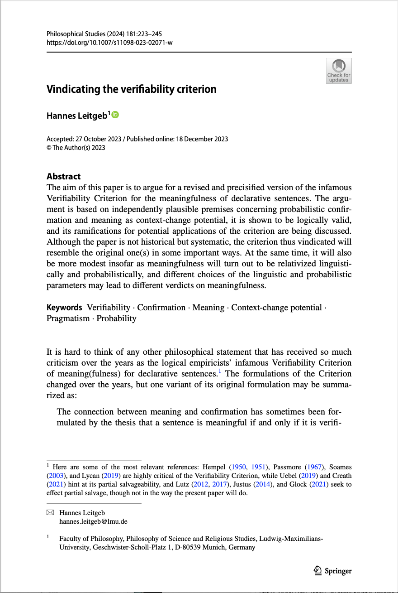
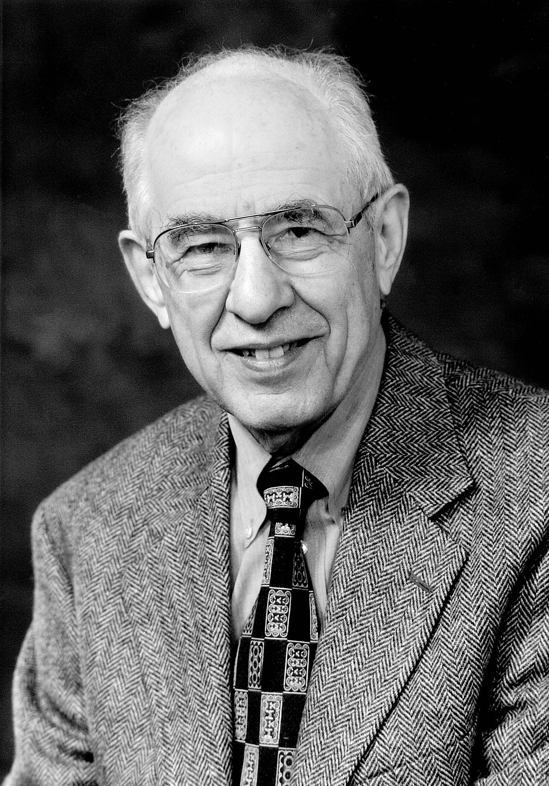
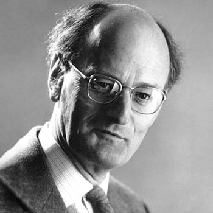
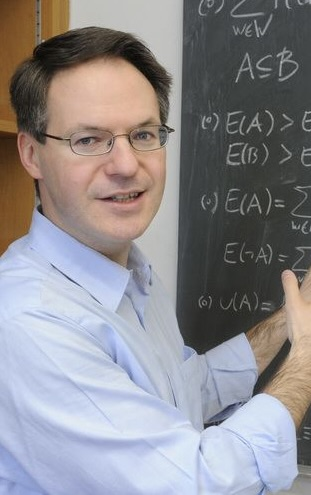

{width=100% height=100vh style="object-fit: contain; display: block; margin: 0 auto;"}

# History, Motivation and Issues of the Original Verifiability Criterion

:::: {.columns}

::: {.column width="70%"}
> The connection between meaning and confirmation has sometimes been formulated by the thesis that a sentence is meaningful if and only if it is verifiable, and that its meaning is the method of its verification. The historical merit of this thesis was that it called attention to the close connection between the meaning of a sentence and the way it is confirmed. [@carnap1936testability, p.421]

:::

::: {.column width="30%"}
{width=100%}
:::

::::

---

:::: {.columns}

::: {.column width="70%"}
### Carnap: Verification is too Narrow

**Excludes some scientific statements:**

- Universal statements (laws of nature) are not verifiable.
- Only single instances can be checked, never all instances.

**Even mundane statements potentially problematic:**

- "There is a white sheet of paper on the table"
- Even this has potentially infinitely many testable implications.

:::

::: {.column width="30%"}
{width=100%}
:::

::::

---

### Solution: Move from Verification to (Dis)confirmation[^1] {#ovc}

::: {.vcenter style="font-size: 50px;"}
**OVC**: A declarative sentence is meaningful iff it is **confirmable or disconfirmable**.
:::

[^1]: We will still call it "Verifiability Criterion" though.

<!-- ## The Self-Undercutting Problem

::: {.incremental}

**Issue**: OVC is itself not confirmable or disconfirmable

But I find this issue comparetively boring.

- But: Principle of tolerance:ß
  - There is no unique "correct" framework---no unique correct language or logic. OVC is one way in which we can choose to structure our scientific discourse.
:::

--- -->

## Normative Statements and the Fact-Value Dichotomy

Carnap in *The Unity of Science*: 

- In the empirical sciences, the logical relationship of their statements to protocol / observation statements can be drawn out. Trying to do this with the statements of classical Philosophy shows the absence of such relations.

> All statements belonging to Metaphysics, regulative Ethics, and (metaphysical) Epistemology have this defect, are in fact unverifiable and, therefore, unscientific. In the Viennese Circle, we are accustomed to describe such statements as nonsense (after *Wittgenstein*). [@carnap1934unity, p. 26]

---

## Putnam

:::: {.columns}

::: {.column width="70%"}
### Verifiability Commits us to a Dichotomy of Fact and Value

> The verifiability criterion implies a dichotomy of values and facts: ethics is not a matter of facts, and matters of fact have nothing to do with ethics. [@putnam_collapse_2004, p.19]

:::

::: {.column width="30%"}
{width=100%}
:::

::::

---

### Values and Rational Acceptability

:::: {.columns}

::: {.column width="70%"}

**Factual statements presuppose values:**

- Coherence, comprehensiveness, simplicity, instrumental efficacy.
- Part of our idea of **cognitive flourishing** and **eudaimonia**.

**Implication**: Some values must be objective (unless science is merely subjective).
:::

::: {.column width="30%"}
{width=100%}
:::

::::

--- 

### Thick Ethical Concepts (TEC) {#TEC}

:::: {.columns}

::: {.column width="70%"}

#### Examples
- "Coward", "considerate", "gentle"

#### Dual Function
1. **Descriptive**: Explain and predict behavior
2. **Evaluative**: Cannot really say something like "Jones is inconsiderate, envious, self-centered and cruel; but he is also a very good person."

:::

::: {.column width="30%"}
{width=100%}
:::

::::

---

:::: {.columns}

::: {.column width="70%"}

#### Indispensability
- Essential for adequate description of reality
- If someone, in their description of someone else, failed to mention that the person is *considerate* or *generous*, they may themselves be criticized as imperceptive or superficial.
<!-- - Regarding the intersubjectivity of such properties, cf. @cavell2002AestheticProblems on aesthetic properties:

> [We have the conviction] that what we are pointing to is *there*, in the object; and [...] while we know not everyone will agree with us when we say it is present, we think they are *missing something* if they don't. [@cavell2002AestheticProblems, p. 89] -->

:::

::: {.column width="30%"}
{width=100%}
:::

::::

---

### Disentangling TEC

:::: {.columns}

::: {.column width="70%"}

>*Descriptive Equivalence*: For every thick term or concept, someone has or could acquire an independently intelligible purely non-evaluative description with the same extension. [@sep-thick-ethical-concepts]

- This is endorsed e.g. by R.M. Hare. On the example of calling an act "cruel", he writes:

> The statement that the victim is suffering, and the statement that the act which made him suffer was wrong, are two distinct statements. [...] We can say 'He was caused to suffer deeply' but add 'All the same, there was nothing wrong with it; it happens all the time in good military academies, and that's the way to produce officers with moral fibre.'" [@hareMoralThinkingIts1981, p.73-4]

:::
::: {.column width="30%"}

:::
::::

---

### Disentangling and Verificationism

- Verificationism seems to commit us to something like Descriptive Equivalence, and to statements involving [TEC](#TEC) being a package deal of two statements, really: 
  - A (cognitively meaningful) statement expressing the coextensive descriptive content; 
  - and a (cognitively meaningless) approval or disapproval of the situation.
- But many (e.g. Putnam, Williams, McDowell) are sceptical about *Descriptive Equivalence*.
- [More on this later](#tec-and-nvc). 

## Leitgeb's Promise:

:::: {.columns}

::: {.column width="60%"}

> ...Are statements of string theory meaningful with respect to the language of relativity theory/quantum mechanics and the set of probability measures available to present-day physicists? Are prescriptive (normative or evaluative) sentences meaningful with respect to a set of descriptive sentences and the set of probability measures available to competent ordinary speakers or professional moral philosophers? (Assuming that probabilities have been assigned to prescriptive sentences, too). At least in principle, any such question can be addressed using appropriate instances of $NVC(\mathcal{L}, \mathcal{S}_O, \mathcal{S}_N, \mathcal{P})$, and there are many more potential applications that may not have concerned the logical empiricists but which may well be relevant today.

[@leitgeb2024vindicating p.236-7]

:::

::: {.column width="40%"}
{width=100%}
:::

::::

# Leitgeb's New Parametric, Probabilistic Verifiability Criterion {#nvc}

:::: {.columns}

::: {.column width="65%"}
- $NVC(\mathcal{L}, \mathcal{S}_O, \mathcal{S}_N, \mathcal{P})$ – A sentence in $\mathcal{S}_N$ is meaningful relative to $\mathcal{S}_O$ and $\mathcal{P}$ iff it is confirmable by members of $\mathcal{S}_O$ relative to $\mathcal{P}$ or disconfirmable by members of $\mathcal{S}_O$ relative to $\mathcal{P}$.
	
Where 

- $\mathcal{L}$ is a language of declarative sentences (assumed to be at least closed under negation, conjunction and disjunction), 
- $\mathcal{S}_O, \mathcal{S}_N$ are subsets of $\mathcal{L}$ and 
- $\mathcal{P}$ is a subset of $Prob(\mathcal{L})$, the set of epistemic probability measures on $\mathcal{L}$ (i.e. maps $\mathcal{L} \rightarrow [0,1]$ which assign value 1 to logical truths and are (finitely) additive for logically inconsistent members of $\mathcal{L}$). 
(Dis)confirmation is explicated as probability in- or decrease upon conditionalization.

[@leitgeb2024vindicating, p. 226]
:::

::: {.column width="35%"}
{width=100%}
:::

::::

---

## Explication of (Dis)confirmation and (Dis)confirmability

:::: {.columns}

::: {.column width="60%"}

- For $A, B \in \mathcal{L}$ and $P\in Prob(\mathcal{L})$, $A$ (dis)confirms $B$ relative to $P$ iff $P(B\mid A)>P(B)$ (respectively $P(B\mid A)<P(B)$)
- For $B \in \mathcal{L}$, $\mathcal{S}_O \subseteq \mathcal{L}$, $\mathcal{P}\subseteq Prob(\mathcal{L})$, $B$ is (dis)confirmable by members of $\mathcal{S}_O$ relative to $\mathcal{P}$ iff there are $A\in\mathcal{S}_O$, $P\in\mathcal{P}$, such that $A$ (dis)confirms $B$ relative to $P$.

:::

::: {.column width="35%"}
{width=100%}
:::

::::
---

## Semantic Motivation – Why Should we Think this Captures "Meaningfulness"?

- Dynamic semantics: Meaning is "context-change potential"
- Bayesian dynamic semantics: The "context" is a set of probability measures and the "change" is updating via conditionalization.
- The resulting credence will then serve as the cogntitive basis of one's rational decision making $\rightarrow$ we capture something like the "pragmatic meaning" of a sentence with [NVC](#nvc)
  - Ramsey, as quoted by Leitgeb: "The essence of pragmatism I take to be this, that the meaning of a sentence is to be defined by reference to the actions to which asserting it would lead." [@moore1927facts, p.170]

---

## Example 1: Tennis

:::: {.columns}

::: {.column width="70%"}
**Sentence**: (T) "At the Miami Open 2022 Alcaraz won 35 out of 50 drop shots."

::: {.incremental}
- For someone who knows what a drop shot is, learning (T) will increase their credence in a sentence like (B) "At the Miami Open 2022 Alcaraz won 35 out of 50 attempts at hitting the ball so lightly that it drops immediately behind the net." So (T) is meaningful to them.
- For someone who doesn't know, maybe it doesn't, so in that sense (T) is not meaningful for them (according to Bayesian dynamic semantics).
- (But note that having a credence in T still makes sense: It can still make sense to bet on T.)

:::

:::

::: {.column width="30%"}
{width=100%}
:::

::::

---

## Example 2: Metaphysical Statements

:::: {.columns}

::: {.column width="70%"}
**Sentence**: (A) "'[The Absolute] enters into, but is itself incapable of, evolution and progress" [@bradley1893appearance, p. 499]

::: {.incremental}
- To test it's meaningfulness, we have to parametrize [NVC](#nvc).
  - Let $\mathcal{S}_N = \{A\}$
  - Empiricists will insist on $\mathcal{S}_O$ being a set of observation sentences, including, say, (C) "The temperature of physical body $b$ at place $s$ and time $t$ is $d$ degrees centigrade", and the like.
  - Let $\mathcal{P}$ be the set of rational degree-of-belief assignments available to the community of logical empiricists.
- $\rightarrow$ (A) is ruled meaningless by NVC
- But Oxford idealists might parametrize differently.
  - They might have a probability measure on which (A) might be confirmed by instances of biological or cultural evolution as perhaps described by some member of $\mathcal{S}_O$. Or their $\mathcal{S}_O$ might contain other sentences about the Absolute.
:::

:::

::: {.column width="30%"}
{width=100%}
:::

::::

---

## Questions for Leitgeb's NVC

- What should we have in mind when NVC speaks of 'probability'?
- Can NVC help us discuss the specific way in which TEC are meaningful?

# What Does it Mean to Assign a Probability to a Sentence?

- The picture is this: We have a set of sentences whose meaning is not in doubt, $\mathcal{S}_O$ (e.g. observation sentences). Then a set of sentences $\mathcal{S}_N$ whose meaningfulness is in doubt.
- If all of the sentences in $\mathcal{S}_N$ can be (dis)confirmed by sentences in $\mathcal{S}_O$, then they are meaningful.
- But in order to know whether $P(B\mid A)>P(B)$, I need to already be assigning a probability to $B$.
- **What does it mean to assign a probability to a sentence I am not even sure is meaningful?**
- @leitgeb2024vindicating [p. 231] suggests that grammatical well-formedness is sufficient for probability ascription. But is it? I am not (yet) sure.

---

## Requirements for a Suitable Concept of Probability

::: {.incremental}
- Leitgeb contrasts his NVC with Skyrms' Bayesian Verifiability Criterion as a test for *knowability*.
  - Skyrms, he says, develops an *epistemic* criterion; Leitgeb wants a *semantic* criterion.
- In the pragmatist spirit Leitgeb seems to be going for, we can say:
  - The better our concept of probability can serve as a guide in life [@carnapProbabilityGuideLife1947], the stronger the semantic claim of the principle.
:::

---

## So: Let's be Subjective Bayesians then?

- Assigning a probability $c$ to $\varphi$ means being willing to bet on $\varphi$ at odds $c:1-c$
  - But to enter into a bet, I need to know how the bet is going to be resolved.
  - Or, at the very least, I need to trust that there \textit{is} a procedure for resolving it.
  - A bet is a bet on $\varphi$ iff: The person who bet on $\varphi$ gets the pot if and only if $\varphi$.
  - This is possible only if there is  procedure for verifying or falsifying $\varphi$.
  - That is, if $\varphi$ already satisfies a quite extreme version of [OVC](#ovc).

---

## Can we be Frequentists?

- Frequentism won't help because
	- a) cannot serve as a guide in life
	- b) likewise seems to presuppose meaningfulness in the [OVC](#ovc) sense
	- (Also note that it would be directly contrary to @carnap1936testability [p.427] who explicitly rejected a proposal by @reichenbach1935induktion [p. 271 ff.] to equate confirmation with the limit of relative frequency.)

We need a concept of probability which can serve as a guide in life (to preserve the pragmatist appeal of Leitgeb's semantics)---i.e. can be called probability$_1$ in Carnap's [-@carnapTwoConceptsProbability1945] diction---and can make sense of assigning probability in a purely formal way, independent of the meaning of the elements of $\mathcal{L}$.

## Inductive Logic

### Relationship with Subjective Bayesian Degree-of-Belief

> From Carnap's point of view, a scientist's personal degree-of belief function would be rationally reconstructed as resulting from *updating* a framework's confirmation measure by evidence. [@sep-carnap]

---

### Formal Statement

- Let $L_n$ be a first-order language consisting of a set of (unary, for now) predicates, individual variables and $n$ individual constants $a_1, \ldots, a_n$ (which are assumed to always denote distinct objects; i.e. if $i \neq j$, then $\vDash a_i \neq a_j$.) 
- Let a *state description* be the conjunction over a consistent and complete set whose members are either atomic sentences or negations of atomic sentences.
	- For example, in a language with predicate $B$ and constants $a_1, a_2$, some state descriptions would be
    1. $\bigwedge\{B(a_1), \neg B(a_2)\}$,
    2. $\bigwedge\{\neg B(a_1), B(a_2)\}$, 
    3. $\bigwedge\{\neg B(a_1), \neg B(a_2)\}$
- Call two state descriptions *isomorphic* if one can be transformed into the other by taking any $\sigma \in S_n$ and applying it to all the indices of the constants in the set. 
	- E.g. the first of the above state descriptions can be transformed into the second by switching $1$ and $2$ in the indices. So they are isomorphic.
	- But neither of them is isomorphic to the third
- This notion of isomorphism defines an equivalence relation $\sim$ on the set of state descriptions

---

- Let ${\mathfrak{D}}$ be the set of all state descriptions. Let $\mathfrak{S}:={\mathfrak{D}}/\!\sim$ be the set of equivalence classes of state descriptions modulo isomorphism. Call the disjunction over the members of an element of $\mathfrak{S}$ a *structure description*.
	- In the above example, the structure descriptions would be:
	- $B(a_1) \wedge B(a_2)$
	- $(\neg B(a_1) \wedge B(a_2)) \vee (\neg B(a_2) \wedge B(a_1)))$
	- $(\neg B(a_1) \wedge \neg B(a_2))$

--- 

### Axioms of Inductive Logic

- Carnap formulates the following adequacy conditions
	1. Probabilism: Satisfy axioms of probability.
	2.  Regularity: Every state description is assigned a positive real number / no possibility is excluded a priori.
	3. Symmetry / Structurality: Two isomorphic state-descriptions are given the same probability.
	4. Indifference (properly construed): Every structure description is given the same probability.

- Question (as a pragmatist subjective Bayesian): Do I have any pragmatic reasons for accepting 3 and 4?
- Also I am still not sure---if this method tells me to assign probabilty $c$ to the sentence "The Absolute enters into..."; what does that mean for me? That I should accept a bet on it at any odds better than $c:1-c$? I still don't know what such a bet even is.

---

### Advantage

Assigns probabilities without asking what the statements to which probabilities are assigned mean, or whether they even have (verificationistic) meaning.

# TEC and NVC

## TEC and Aesthetic Judgment

:::: {.columns}

::: {.column width="80%"}

How are TEC different and similar to observation terms?

- Bernard Williams on the difference between ethical and theoretical disagreement:

> In a scientific inquiry, there should ideally be convergence on an answer, where the best **explanation** of the convergence involves the idea that the answer represents **how things are**; in the area of the ethical [...], there is no such coherent hope. [@WilliamsBernard2011Eatl, p. 150]

- And Hannah Ginsborg on the normativity of aesthetic judgments:

> I take my own pleasurable response to the object to be **appropriate to or called-for by the object**. [...] But [...] since beauty is not an objective property of things I cannot claim that my finding the flowering cherry beautiful is appropriate to the flowering cherry just because it is, in fact, beautiful. [..] there are **no test criteria** I can employ to justify my claim. [@ginsborgAestheticNormativityKnowing2020, p. 57-8]

:::

::: {.column width="20%"}

{width=85%}

{width=85%}

:::

::::

<!-- ### Kant on Aesthetic Judgment

:::: {.columns}

::: {.column width="70%"}
> "als Nothwendigkeit, die in einem ästhetischen Urtheile gedacht wird, nur exemplarisch genannt werden, d. i. eine Nothwendigkeit der Beistimmung aller zu einem Urtheil, was als Beispiel einer allgemeinen Regel, die man nicht angeben kann, angesehen wird. Da ein ästhetisches Urtheil **kein objectives und Erkenntnißurtheil** ist, so **kann diese Nothwendigkeit nicht aus bestimmten Begriffen abgeleitet werden und ist also nicht apodiktisch**. Viel weniger kann sie aus der Allgemeinheit der Erfahrung (von einer durchgängigen Einhelligkeit der Urtheile über die Schönheit eines gewissen Gegenstandes) geschlossen werden. Denn nicht allein daß die Erfahrung hierzu schwerlich hinreichend viele Beläge schaffen würde, so **läßt sich auf empirische Urtheile kein Begriff der Nothwendigkeit dieser Urtheile gründen**" 

[@kant1907kritik, 237]

- @cavell2002AestheticProblems [p. 89] on @kant1907kritik in @carnap1936testability [p.454-6]'s terms: Aesthetic properties are neither observable nor realizable.

:::

::: {.column width="30%"}
{width=100%}
:::

::::

--- -->

## Arguing about Aesthetic Judgments

:::: {.columns}

::: {.column width="65%"}

  "He plays beautifully, doesn't he?"\
  "How can you say that? There was no line, no structure, no idea what the music was about. He's simply an impressive colorist."\
  ["Well, it was beautiful *for me*."]{style="color: grey;"}

  [@cavell2002AestheticProblems, p. 91]

:::

::: {.column width="35%"}
{width=100%}
:::

::::

---

## Arguing about TEC

:::: {.columns}

::: {.column width="65%"}

"Say about Trump what you will, but the way he acted under fire was really courageous."\
"That wasn't courage, that was vanity!"\
"How can it be vanity? His ear was pierced by a bullet! He was literally risking his life!"\
"Yes, but not for anyone else's sake. Only for the sake of his own public image. That's vanity."\
["Well, it was courageous *for me*."]{style="color: grey;"}

:::

::: {.column width="35%"}
{width=100%}
:::

::::

---

## Judgments Involving TEC

:::: {.columns}

::: {.column width="65%"}

- Judgments containing TEC share some similarities with aesthetic judgments
  - Both cannot be proven or tested in the way empirical judgments (sometimes) can; but both require and allow for argument, with refusal to respond to relevant arguments coming at a price.
- They cannot be reduced to observation judgments, if we follow @mcdowell1981noncognitivism in rejecting *Descriptive Equivalence*:

>*Descriptive Equivalence*: For every thick term or concept, someone has or could acquire an independently intelligible purely non-evaluative description with the same extension. [@sep-thick-ethical-concepts]

- Can we capture this discussion with NVC?

:::

::: {.column width="35%"}
{width=100%}
:::

::::

---

## Descriptive Equivalence in Leitgeb's Framework

Consider a language $\mathcal{L}$ containing TEC and a set of probability measures $\mathcal{P}$. We can formulate the following versions of *descriptive equivalence*:

- Strong: For every thick term or concept $T$, there is a formula $\varphi(x)$ in $\mathcal{L}$ containing only non-evaluative predicates such that for *every* $P \in \mathcal{P}$, constant $c$ and sentence $A \in \mathcal{L}$, $P(T(c) \mid A) = P(\varphi(c) \mid A)$.
- Weak: For every thick term or concept $T$, there is a formula $\varphi(x)$ in $\mathcal{L}$ containing only non-evaluative predicates such that for *some* $P \in \mathcal{P}$, $P(T(c) \mid \varphi(c)) \neq P(T(c))$.

Note: We can reject strong descriptive equivalence and still have NVC assert the meaningfulness of sentences involving TEC relative to purely descriptive sentences: Weak descriptive equivalence is sufficient for this.

---

## Example: Slurs

:::: {.columns}

::: {.column width="65%"}

- Consider the sentence "Korbinian is a *Piefke*"
  - Has both descriptive and evaluative content---among others things that I am German and that I am a German *in the bad way*.
- If our language contains the predicate 'German' and if $S_O$ contains the sentences asserting this predicate or its negation of individuals, then such a sentence would be ruled meaningful by NVC on any plausible $\mathcal{P}$, since learning that someone *isn't* German would immediately rule out their being a *Piefke*.
- (It is less clear whether learning that someone *is* German would immediately confirm that they *are* a *Piefke*)
- But in any case, NVC seems well-equipped to give the correct verdict on the meaningfulness of slurs.

:::

::: {.column width="35%"}
{width=100%}
:::

::::

---

## Are Slurs Really TEC in the Narrow Sense?

- E.g. @chappell2013thin writes that slurs are not amalgams of a neutral description and an evaluative tone, but of a caricature and an evaluative tone ("Piefke" doesn't ever *descriptively* match any real German, but only a caricature of a German).
- The case for the indispensability of slurs also seems weaker than for other TEC. A description will rarely be *inadeqate* for a lack of slurs.
- In any case, for paradigm TEC, an observation or even a descriptive fact cannot usually (dis)prove sentences involving them.

## How to Parametrize NVC to Acccount for TEC

### Sufficient Leitgeb Basis

- Can we adapt the concept of a "sufficient basis" from *Testability and Meaning* to frame our discussion?

> A class $C$ of descriptive predicates of a language $\mathcal{L}$ such that every descriptive predicate of $\mathcal{L}$ is reducible to $C$ is called a *sufficient basis* of $\mathcal{L}$ [@carnap1936testability, p.468]

- Proposed definition:

If $S_M$ is the set of meaningful sentences in $\mathcal{L}$ and $\mathcal{P}$ a set of probability measures on $\mathcal{L}$, call $S_B\subseteq \mathcal{L}$ a *$\mathcal{P}$-sufficient Leitgeb basis* iff $$NVC(\mathcal{L}, S_B, S_M, \mathcal{P}) = 1$$ 

---

### Sufficient Leitgeb Basis if TEC are Meaningful

- If $\mathcal{P}$ makes weak descriptive equivalence false, and if $S_M$ contains TEC, then any $\mathcal{P}$-sufficient Leitgeb basis will have to include some sentences expressing (quasi&#8209;)aesthetic judgments.
  - N.B.: If we follow McDowell, our $\mathcal{P}$ should definitely make strong descriptive equivalence false. I don't know yet whether we would be committed to rejecting weak descriptive equivalence as well.
- This would be a problem for empiricists (if they want a basis consisting of observation sentences and if Kant (and Kantians like Ginsborg and McDowell) are right about aesthetic judgment having mere subjective generality for lack of picking up on any observable property of the object).

## Descriptive Equivalence in Inductive Logic

::: {.incremental}
- Will Inductive Logic generally lead to $\mathcal{P}$ which make weak descriptive equivalence false?
- My suspicion is yes but I do not know yet.
:::

# Summary
- Leitgeb formulates a parametric, probabilistic version of the verifiability criterion.
- It is not clear what "probability" means here and whether he can have his cake (connect to pragmatic meaning) and eat it too (assign probabilities to potentially meaningless sentences).
- Concerning TEC, I suggest that NVC implies that either weak descriptive equivalence must hold or some (quasi&#8209;)aesthetic judgments must be primitively meaningful.

# References
